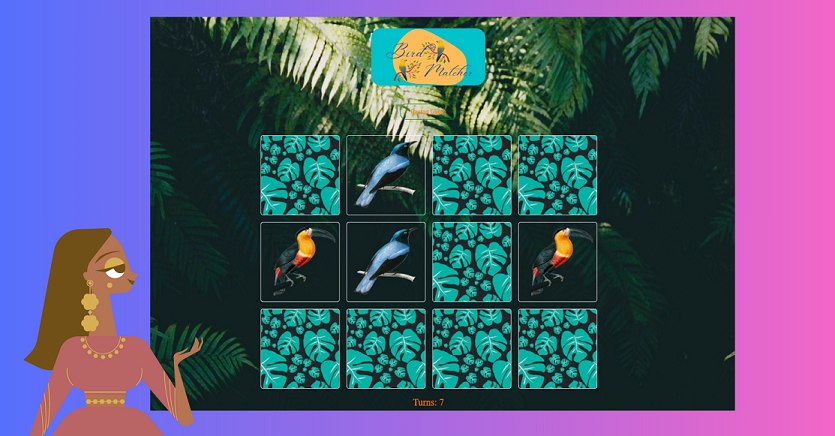

# Memento: The Bird Matcher Edition

Help each bird in finding its lost soulmate.

## 🔮 Technologies

This application was made using these wonderful technologies:

 
&nbsp&nbsp&nbsp&nbsp&nbsp 
 
&nbsp&nbsp&nbsp&nbsp&nbsp 
 
&nbsp&nbsp&nbsp&nbsp&nbsp 
 
&nbsp&nbsp&nbsp&nbsp&nbsp

## 🏛 Architecture

